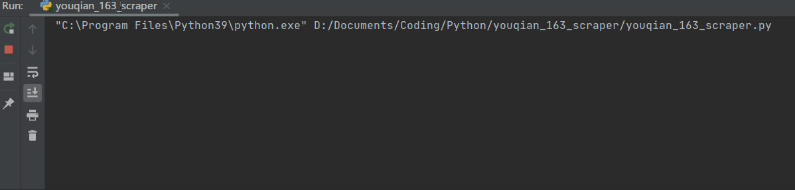

# 网易有钱账单导出爬虫
## 2020/12/22 更新说明

网易有钱发布[公告](https://1.163.com/html/qian/web/5fdaffaed605e84a6d118cd4.html)停止运营，所有页面都被自动重定向到公告页面，导致网易有钱网页版不能登录，也因此无法通过网页返回的数据获取账单，以下方法可能已经失效。
好消息是目前官方已经将所有个人账户开通会员服务，在手机端所有账单可以免费导出。

## 用途

由于网易有钱 App 目前处于无人维护的状态，无法通过充值会员等正常途径导出账单，此程序通过爬取[网易有钱网页版](https://qian.163.com)的数据生成 csv 格式的账单数据。



## 使用方法

### 1. 配置参数

- Cookies 配置

  

  登录[网易有钱](https://qian.163.com/pc/login.html)，按 F12 键调出开发者选项，进入 `Application -> Cookies -> https://qian.163.com`，找到所有的 Cookies 信息。

  

  将 cookie 对应的值依次填写在代码中对应的位置，以代替`请修改此个人数据`。如果本地浏览器没有保存某一项 Cookies，可以将该字段整个删除。

  ```python
  cookies = {"SERVER_ID": "请修改此个人数据",
           "TOKEN": "请修改此个人数据",
           "mail_client_uuid": "请修改此个人数据",
           "NTES_OSESS": "请修改此个人数据",
           "S_OINFO": "请修改此个人数据",
           "P_OINFO": "请修改此个人数据"
           }
  ```

- url 配置

  将 Cookies 中的 TOKEN 字段代替`请修改此个人数据（和 cookies 中的 TOKEN 值相同）`。

  ```python
  url = "https://qian.163.com/pc/xhr/data/bill/list.do?token=请修改此个人数据（和 cookies 中的 TOKEN 值相同）"
  ```

- 导出文件名

  将 `file_name` 的值修改为你想要的文件名，如果不存在该文件会自动创建（推荐）。

  ```python
  file_name = 'youqian.csv'
  ```

- 账单的开始和结束时间

  如需要导出 `2017-01-01` 到 `2020-11-11` 期间的账单数据，则填写为：

  ```python
  start_time = datetime(2017, 1, 1)
  end_time = datetime(2020, 11, 11)
  ```

- 导出的账单类型

  取值有 `TRANSFER`、`INCOME`、`OUTGO` 三种类型，分别表示转账记录、收入和支出。如果需要全部导出，则需要执行三次，分别得到三个文件（每次执行时`导出文件名`也需要更改）。

  ```python
  bills_type = "OUTGO"
  ```

### 2. 说明

导出的 csv 文件编码格式为 `UTF-8` 类型，如果使用 Microsoft Excel 打开有乱码，请修改编码格式为 `gb2312`。
